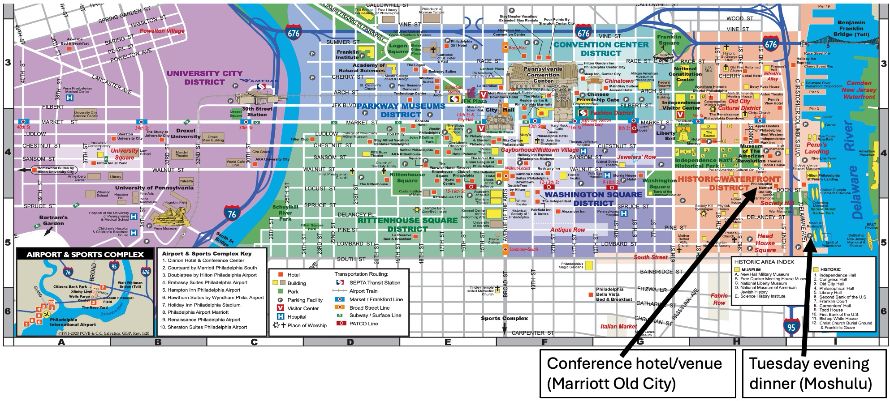

## Map of Center City Philadelphia

[See the full map](https://www.visitphilly.com/wp-content/uploads/2024/04/Walking-Flat-PHLCVB-Map.pdf)

## Things to Do or See

Consult our [Google Map List](https://maps.app.goo.gl/JW73CWgCyTsP3mMr8) to get your bearings relative to Old City on a few of the locations listed below.

**Historical:**
- [Betsy Ross House](https://historicphiladelphia.org/betsy-ross-house/) – Birthplace of the American flag.
- [Liberty Bell/Independence Hall](https://www.nps.gov/inde/planyourvisit/independencehall.htm) – Iconic symbols of U.S. freedom and democracy.
- [Museum of the American Revolution](https://www.amrevmuseum.org/) – Stories and artifacts from America’s founding.
- [The Academy of Natural Sciences of Drexel University](https://drexel.edu/about/locations/academy-natural-sciences) – Dinosaurs, dioramas, and discovery.
- [Constitution Center](https://constitutioncenter.org/) – Interactive exhibits about the U.S. Constitution.
- [Navy / Marine Corps 250th Anniversary](https://www.homecoming250.org/) - Events throughout the city, begins the day after the conference ends.

**Cultural:**
- [Philadelphia Magic Gardens](https://www.phillymagicgardens.org/) – A vibrant mosaic art installation.
- [Philadelphia Museum of Art](https://philamuseum.org/) – World-class collection (and the famous “Rocky Steps”).
- [Rodin Museum](https://rodinmuseum.org/) – The largest Rodin collection outside Paris.
- [Franklin Institute](https://fi.edu/en) – Hands-on science museum for all ages.
- [Independence Seaport Museum](https://www.phillyseaport.org/) – Maritime history along the Delaware River.
- [Philadelphia Zoo](https://www.philadelphiazoo.org/about-the-zoo/) - America's first zoo and one of the [nation's best](https://10best.usatoday.com/awards/philadelphia-zoo-philadelphia-pennsylvania/).

## Places to Eat

Keep in mind, the conference registration fee includes breakfast and lunch on Monday, Tuesday, and Wednesday. Additional evening reception events (see the [program](https://us-rse.org/usrse25/program/)) with some food and drinks will also be held and included in the registration fee. 

**Places for Dinner (Old City)**

[Google Maps Restaurant List](https://maps.app.goo.gl/rhDzkr5QqzftMc3r9) – Curated local favorites near the conference.

- Cuba Libre – Lively Cuban cuisine and cocktails.
- Zahav – Award-winning modern Israeli; book early!
- Buddakan – Stylish spot for Asian fusion fare.
- Amada Philadelphia – Upscale Spanish tapas and wine.
- Khyber Pass Pub – Casual BBQ and craft beer hangout.
- Lucha Cartel – Funky venue for bold Mexican dishes.
- Malooga – Cozy spot for authentic Middle Eastern eats.
- Talula’s Garden – Seasonal French-inspired farm-to-table dining.
- Revolution House – Rooftop bar with American favorites.
- Spasso Italian Grill – Traditional Italian comfort food.
- Positano Coast – Elegant seafood with coastal Italian flair.

**Philly Cheesesteaks** 

[Google Maps List](https://maps.app.goo.gl/2nkRi3u8n72LVseV6): 
- Oh Brother Philly
- Sonny’s Famous Cheesesteaks
- Jim's South St.

**Ice Cream (near the hotel):**
- Franklin Fountain – Old-school soda fountain with handmade treats.

