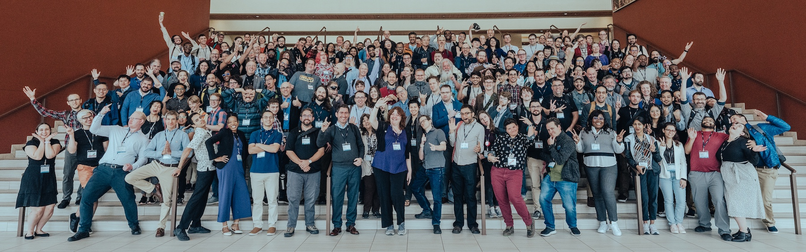

## Venue Information

[Philadelphia Marriott Old City](https://www.marriott.com/en-us/hotels/phlmo-philadelphia-marriott-old-city/overview/)

October 6-8, 2025

## Travel Planning

Please see the [travel page](travel/) for room reservation links and more details.

## Schedule Overview

#### Sunday: October 5

Plan to arrive on Sunday.  We'll get an early start Monday morning, and we're working on an informal registration reception on Sunday evening.

#### Monday: October 6

We will be starting early Monday morning with the first keynote address.  The day includes an evening activity.

#### Tuesday: October 7

A full day of conference activities, including an evening activity.

#### Wednesday: October 8

The official program will end mid-afternoon by 3:30 pm.  

## Accessibility

We are confident that you will have a good experience at USRSE'25!  100% of respondents to the 2024 feedback survey said they would recommend the event to others.

If there is an accommodation that will support your conference attendance, please let us know as soon as possible: [usrse25-conference@us-rse.org](mailto:usrse25-conference@us-rse.org)

We are still finalizing event details and will provide more information as it is available.  A few details we can share:

* An all-gender restroom will be available.
* A small quiet room (sits about 10 people at a conference table) will be available during conference programming.
* If you need a nursing or medical room during the event and will not have your own hotel room at the Marriott, please let us know at [usrse25-conference@us-rse.org](mailto:usrse25-conference@us-rse.org) and we will ensure that one is available.
* The conference registration form will ask about any food restrictions or allergies.  The planned, general menu will be shared before the conference starts.
* The [hotel website](https://www.marriott.com/en-us/hotels/phlmo-philadelphia-marriott-old-city/overview/) includes floorplan information and 3D walk-throughs of the common spaces if you'd like to familiarize yourself with venue before attending.
* If you need a letter to support a travel visa application, please contact [usrse25-conference@us-rse.org](mailto:usrse25-conference@us-rse.org).
* We take the [Code of Conduct](about/code-of-conduct/) seriously.

If there is something that you're concerned about, please contact us at [usrse25-conference@us-rse.org](mailto:usrse25-conference@us-rse.org).  We want all members of the US-RSE community to be comfortable attending the event. 

