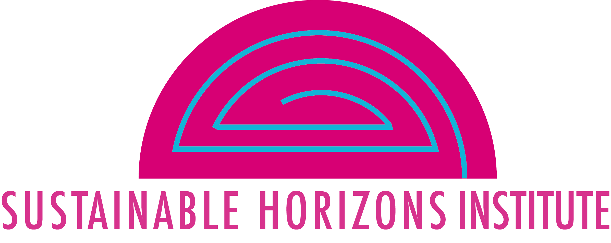

## Hotel

[Philadelphia Marriott Old City](https://www.marriott.com/en-us/hotels/phlmo-philadelphia-marriott-old-city/overview/)  
One Dock St, Philadelphia, PA 19106

### Room Reservations

We'd greatly appreciate you staying at the conference hotel.  Maintaining reasonable conference registration rates requires that we fill the hotel room reservation block.

Please plan to arrive on Sunday, October 5, 2025.  The conference starts early Monday morning, and we are planning an informal networking event on Sunday evening.

A room block at the hotel is available for Sunday, Monday, and Tuesday nights.  

* [Regular reservation link](https://www.marriott.com/event-reservations/reservation-link.mi?id=1737661853085&key=GRP&guestreslink2=true&app=resvlink ) - $239/night + taxes
* [Government rate reservation link](https://www.marriott.com/event-reservations/reservation-link.mi?id=1737661921114&key=GRP&guestreslink2=true&app=resvlink ) (for valid government employee travel) - $218/night + taxes

If the room block is full, please contact us at [usrse25-conference@us-rse.org](mailto:usrse25-conference@us-rse.org) so we can investigate adding additional rooms.

**Room reservations must be made by September 12, 2025.**

If you want to add additional days to your registration, please call the hotel to modify your registration (+1 215-238-6000).  If you plan to arrive Saturday, we encourage you to make your room reservation early; the hotel has indicated that they usually sell out on Saturday nights.

We unfortunately needed to limit the room block to Sunday through Tuesday nights because we have to pay for rooms that aren't filled.

## Food

The conference registration fee includes breakfast and lunch on Monday, Tuesday, and Wednesday.  

Additional evening reception events with some food and drinks will also be held and included in the registration fee. 

## Getting to Philadelphia

The Philadelphia International Airport (PHL) is about 20 minutes/10 miles from the conference hotel.  The hotel does NOT have an airport shuttle.

The Philadelphia Amtrak train station is 2.5 miles from the conference hotel. 

Newark Liberty International Airport (EWR) is a little over an hour from Philadelphia.

The daily parking rate at the hotel is $60.  There are additional parking garages approximately a 1/2 mile from the hotel.  

## Travel Grants

There is currently one program to support travel and attendance for some attendees -- please see below for information on the Building Engagement (BE) program from the Sustainable Horizons Institute (SHI). If additional programs/grants to support travel and attendance become available, we will add those below.

### Sustainable Horizons Institute - Building Engagement (BE) program

The BE program is designed to expand the professional association by supporting attendees from a variety of backgrounds. The application for funded participants opens August 11 with a deadline of August 22. The BE program also has [opportunities for volunteers](https://us-rse.org/usrse25/participate/volunteer/).

Visit Sustainable Horizon Institute's [BE@US-RSE25 page](https://shinstitute.org/building-engagement-us-rse-2025/) for details on the application, eligibility, and key dates. If you have any questions please contact: BE@shinstitute.org

